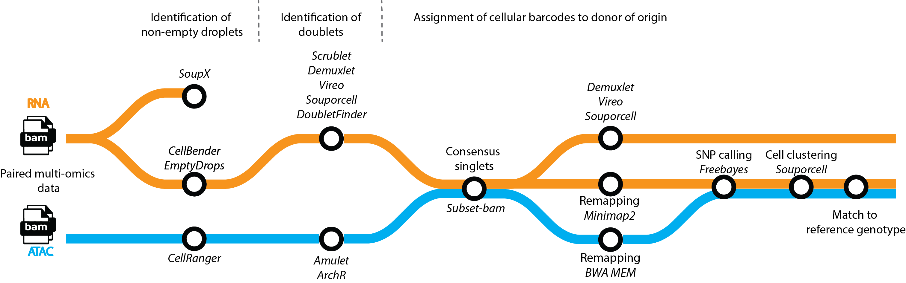

## Genetic demultiplexing of single-cell and single-nuclei omics

### Contents of this repository
This repository contains a Snakemake workflow that enables genetic demultiplexing of single-cell, single-nuclei, CITEseq and paired Multiome (RNA+ATAC) data.

### Installation and dependencies
#### Conda environments
Conda YAML files are provided for all the tools in `envs/`. Users can create named environments from these files by running `conda env create -f {file}`. These environments contain most of the dependencies but not all, see below for other tools that need to in $PATH.

#### External dependencies
Some tools require additional dependencies, listed below. These tools can either be installed centrally and consequently symlinked (e.g. `ln -s`) inside the miniconda env bin directory, or installed inside each miniconda env separately.

Environment:
- Souporcell: [minimap2](https://github.com/lh3/minimap2.git), [samtools](https://github.com/samtools/samtools.git), [vartrix](https://github.com/10XGenomics/vartrix.git)
- Vireo: [cellsnp-lite](https://github.com/single-cell-genetics/cellsnp-lite.git)
- Demultiplex_atac: [subset-bam](https://github.com/10XGenomics/subset-bam.git), [samtools](https://github.com/samtools/samtools.git), [bwa mem](https://github.com/lh3/bwa.git), [vartrix](https://github.com/10XGenomics/vartrix.git)

For the following rules, the corresponding R packages need to be installed and accessible:
- DoubletFinder: [DoubletFinder](https://github.com/chris-mcginnis-ucsf/DoubletFinder)
- ArchR: [ArchR](https://github.com/GreenleafLab/ArchR)
- EmptyDrops: [DropletUtils](https://bioconductor.org/packages/release/bioc/html/DropletUtils.html)
- Soupx: [soupx](https://github.com/constantAmateur/SoupX)

### Running the workflow

This github contains a shell script that accepts the following commands:
-  `./run`:  Without argument, will run the normal workflow entirely based on user-given input (see below)
-  `./run dry`: dry run using Snakemake's `-p -n` arguments
-  `./run unlock`: Unlock snakemake directories after sigkill.

Running these commands from the top-level directory will execute the appropriate Snakemake commands.

### Configuring Snakemake on a high-performance cluster or job scheduling system

It is not necessary to change the underlying code to configure this pipeline to work on a different scheduler or HPC. Instead, adjust `config/config.yaml` to your needs and the local installation. For many different schedulers, snakemake configs are readily available.

### Input and user-specified parameters
The input of the workflow is an excel-sheet that must contain the following columns:

- **pool**: The name of the pool to be demultiplexed, will be name of the output folder too
- **datalocation**: Location of top-level Cellranger folder
- **donors**: nr of donors multiplexed in that specific pool
- **vcf**: Reference genotype file. Recommend to impute first.
- **comment**: May be empty, is not used.
- **profile**: Datatype, either RNA/ATAC/Multiome for now.

Change the name of the excel sample sheet at the top of the Snakemake file (`dmx.smk`), and change the output directory here too, along with the location of the CellRanger reference genomes and indices.

### Author
Martijn Zoodsma, martijn.zoodsma@helmholtz-hzi.de
Centre for Individualised Infection Medicine, Helmholtz Centre for Infection Research, Hanover, Germany.

Principal investigator: Yang Li
Centre for Individualised Infection Medicine, Helmholtz Centre for Infection Research, Hanover, Germany.
